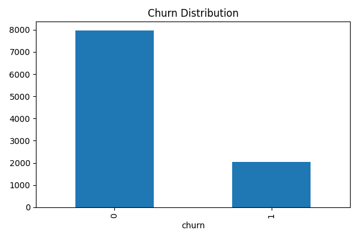
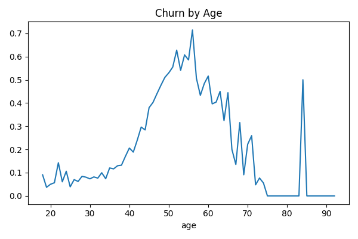

# Bank Customer Churn Analysis

This project analyzes customer churn in a bank dataset.

## Key Insights:
- Germany has the highest churn rate (~32%)
- Customers with 2 products are most loyal
- Female customers have higher churn rates

## Tools Used:
- Python
- Pandas
- Matplotlib

- ## Sample Output

### Churn Distribution

### Churn by Age

